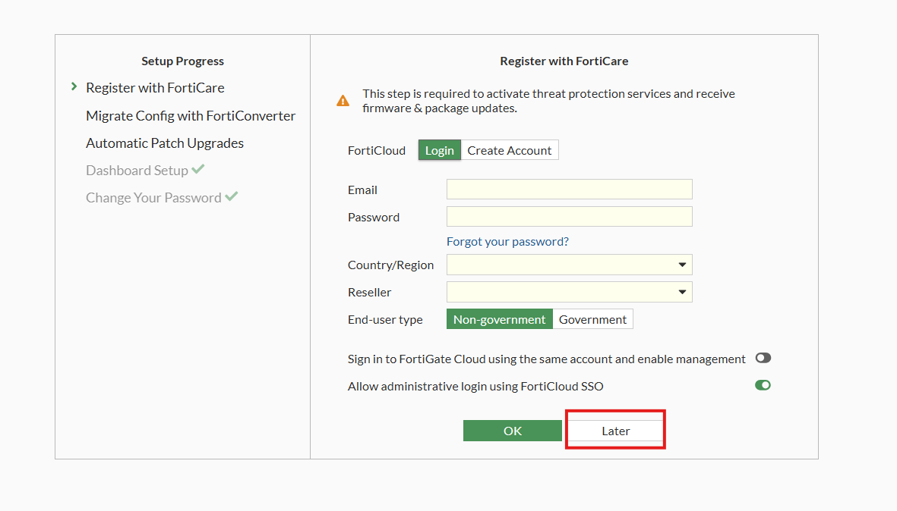
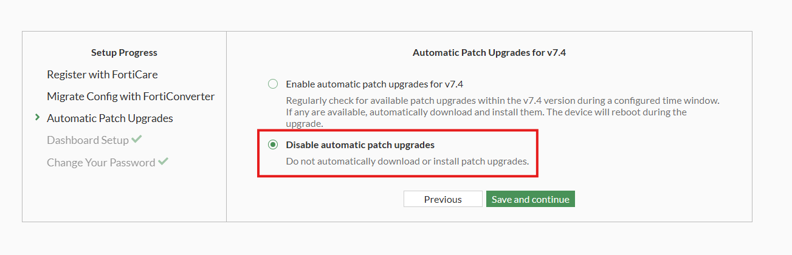

# FortiGate gadgets

**The tools in this repository are intended for security research purposes only and should not be used in production environments.**

## License

### FDS server

The `fds_server.py` is a custom licensing server for FortiGate which can be used for older versions such as FortiGate VM64 v7.4.1. Compared with the previous method, using the FDS server allows for modification of serial number (including prefixes), can increase the number of cpus and memory, and can also activate more VDOMs. Currently, this method can only be applied to the old versions.

**How to use**

Take FortiGate VM64 7.4.1(VMWARE) as an example.

First, you need to deploy the VM and complete the configuration of the network interface in the CLI. Then you need to start the FDS server on a system that is in the same network as the FortiGate (Make sure that FortiGate can access port 8890 of the FDS server).

Execute the following commands on FortiGate:

```
config system central-management
    set mode normal
    set type fortimanager
    set fmg <FDS server's ip address>
    config server-list
    edit 1
        set server-type update rating
        set server-address <FDS server's ip address>
	end

    set fmg-source-ip <FortiGate's ip address>
    set include-default-servers disable
    set vdom root
end
```

Run the `license_old.py` script to generate a License file, login to the web service of FortiGate and import this License file.

The system will restart automatically. After the system starts up, you should be able to see some output on the FDS server, for example:

```
========================
[*] Parsing data
[+] Magic: PUTF
[+] System version: 07004000
[+] Payload length: 363
[+] Header length: 64
[+] Time: 202505301704
[+] Header crc32: 0x946cdd64
[*] Parsing obj
[+] Magic: FCPC
[+] Name: Command Object
[+] Payload length: 235
[+] System version: 07004000
[+] Payload crc32: 0x209e4867
[+] Header crc32: 0xaa2ece4
[+] Payload: b'Protocol=3.0|Command=VMSetup|Firmware=FGVM64-FW-7.04-2463|SerialNumber=FGVM32GVOVCLUK2G|Connection=Internet|Address=192.168.66.150:0|Language=en-US|TimeZone=-7|UpdateMethod=1|Uid=564d678fc9f2506bb8aebfde4052bbbd|VMPlatform=VMWARE\r\n\r\n\r\n'
[*] Packing obj
[*] Packing req
[*] Sending response
```

Log in to the web service. If everything went well, you will enter the configuration wizard. **DO NOT register with FortiCare and DISABLE automatic patch upgrades.**





**Disadvantages**

The FortiCare support is missing so the system can not receive any AntiVirus/IPS/Firmware/etc updates.

Some functions may not work properly (untested).

If you encounter any problems, please raise an issue.

### Versions > 7.4.1

**This part has not been updated.**

For newer versions, you need to patch `flatkc` and `init` first. Please follow the steps below.

```
1. Import the ovf template and start the system. Wait for the system to complete initialization
2. Shut down the VM and remove the first vm disk (2GB)
3. Install the vm disk on another Linux system
4. Mount the root partition (FORTIOS) and extract the "flatkc" and "rootfs.gz" files, make sure to backup them
5. Run command: 'python3 decrypt.py -f rootfs.gz -k flatkc' to decrypt the rootfs.gz file
6. Uncompress the rootfs.gz and the bin.tar.xz files, you need to be root when doing this
       gzip -d ./dec.gz
       mkdir rootfs
       cd rootfs && mv ../dec ./
       sudo su
       cpio -idmv < ./dec
       rm -rf ./dec
       xz -d ./bin.tar.xz && tar -xvf ./bin.tar && rm -rf ./bin.tar
       cd .. && mv ./rootfs/bin/init ./
7. Run command: 'python3 patch.py init' to patch the init file
8. You can add other files (busybox etc) if you want. Then re-compress the rootfs.gz
       chmod 755 ./init.patched && mv ./init.patched ./rootfs/bin/init
       cd rootfs
       tar -cvf bin.tar bin && xz bin.tar && rm -rf bin
       find . | cpio -H newc -o > ../rootfs.raw && cd ..
       cat ./rootfs.raw | gzip > rootfs.gz
9. Run command: 'python3 patch.py flatkc' to patch the flatkc file
10. Overwrite rootfs.gz and flatkc.patched to the vm disk
11. Uninstall the vm disk from Linux system and install it to the original system
12. Boot the system
```

After starting the system, run the `python3 license_new.py` command and import the generated `License.lic` file to the system.

Note: You may need to change the network adapter IP address again after restarting the system

Please see https://wzt.ac.cn/2024/04/02/fortigate_debug_env2/ for more details.

### VDOM license

You need to install libssl-dev first.

Compile: `gcc vdom.c -o vdom -lssl -lcrypto -lz`

Run: `./vdom FGVMPG0000000000 15`

Import the license: `execute upd-vd-license xxx`

If you see `Error: VDOM number (xxx) exceeds limit for this model` then your base license does not support too many vdoms.
